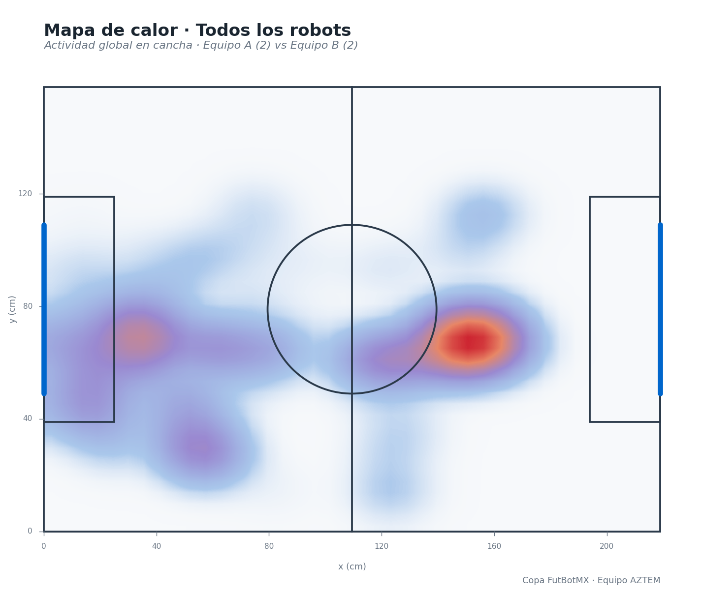

# AZTEM Copa FutBotMX


---

## 1. Descripción General

Este repositorio contiene un pipeline reproducible de Visión por Computadora e Inteligencia Artificial diseñado para la segmentación, tracking y análisis estadístico de partidos de la Copa FutBotMX 2026. El sistema procesa video original para extraer métricas de juego clave de manera automatizada.

---

## 2. Integrantes y Roles

| ID | Nombre | Rol |
|----|--------|-----|
| A1 | Sebastián René García Herrero | Líder Técnico + Módulo de Segmentación (SAM 2/3) e Integración de Pipeline |
| A2 | Juan Pablo Lopez Moreno | Módulo de Tracking y Estructuración de Datos (CSV) |
| A3 | José de Jesús Flores Rojas | Módulo de Análisis/Visualización y Producción de Video Demo |

---

## 3. Categoría

**Amateur** — Análisis de Video con Visión por Computadora

---

## 4. Objetivo del Proyecto

Entregar un repositorio público con un pipeline reproducible que use SAM 2/3 para segmentar robots y balón en videos de FutBotMX, generar tracking básico, visualizaciones del partido y un video demo claro.

---

## 5. Arquitectura del Pipeline

Flujo conceptual general:

```
Video Original
  → 01_extract_frames.py         (Extracción de Frames)
  → 00_preprocess.py             (Corrección de perspectiva / recorte de cancha)
  → 02_segment_with_sam.py       (Segmentación con SAM 2/3)
  → 03_extract_centroids.py      (Cálculo de Centroides)
  → 04_track_objects.py          (Tracking de Objetos)
  → tracking_data.csv            (Exportación de CSV)
  → 07_detect_events.py          (Detección de Eventos)
  → 06_generate_visualizations.py (Generación de Visualizaciones)
  → 05_generate_dashboard.py     (Dashboard HTML interactivo)
  → 08_export_demo_video.py      (Video Demo Final)
```

> **Nota:** `00_preprocess.py` y `05_generate_dashboard.py` no estaban en este diagrama originalmente; se agregan aquí porque sí forman parte del flujo real (`00` recorta y endereza la cancha antes de segmentar; `05` consume las imágenes de `06` y los eventos de `07` para armar el dashboard final).

---

## 6. Instalación

Para configurar el entorno local e instalar las dependencias necesarias, ejecute los siguientes comandos en la terminal:

```bash
# Clonar el repositorio
git clone https://github.com/tu-usuario/futbotmx-vision-amateur.git
cd futbotmx-vision-amateur

# Crear y activar un entorno virtual
python -m venv venv
source venv/bin/activate  # En Windows use: venv\Scripts\activate

# Instalar dependencias
pip install -r requirements.txt
```

> **Nota:** Se requiere `scipy` para la resolución de optimización lineal (Algoritmo Húngaro) y el cálculo de regiones de Voronoi.

> **Alternativa con conda** (entorno usado para el desarrollo y prueba de este pipeline, recomendado si vas a usar GPU NVIDIA en Windows):
>
> ```bash
> conda create -n sam3env python=3.10 -y
> conda activate sam3env
> pip install -r requirements.txt
> ```
>
> SAM 2/3 no se instala vía `pip install -r requirements.txt`: hay que clonar el repositorio oficial de Meta (`https://github.com/facebookresearch/sam3`) y seguir sus instrucciones, incluyendo la descarga del checkpoint del modelo. Esto está sujeto a la SAM License (ver punto 12, Créditos).

---

## 7. Cómo Ejecutar

### Ejecución Modular Paso a Paso

El pipeline permite auditar cada etapa ejecutando los scripts individuales en orden secuencial:

```bash
python src/01_extract_frames.py         # Extrae fotogramas individuales
python src/00_preprocess.py             # Corrige perspectiva y recorta la cancha
python src/02_segment_with_sam.py       # Genera máscaras de píxeles con SAM
python src/03_extract_centroids.py      # Determina centros de masa e introduce homografía
python src/04_track_objects.py          # Asigna IDs de seguimiento temporal
python src/07_detect_events.py          # Analiza interacciones (pases y tiros)
python src/06_generate_visualizations.py # Renderiza gráficos estadísticos y mapas
python src/05_generate_dashboard.py     # Arma el dashboard HTML interactivo
python src/08_export_demo_video.py      # Ensambla el video demo final
```

> **Nota sobre el orden:** aunque el número en el nombre del archivo sugiere otro orden, `07_detect_events.py` debe correr **antes** que `06_generate_visualizations.py` (varias vistas de `06` -- pases, tiros, posesión, red de pases -- leen el CSV de eventos que genera `07`), y `05_generate_dashboard.py` debe correr **después** de `06` y `07` (consume las imágenes y el CSV de eventos de ambos). El orden de la lista de arriba es el real, no el numérico.

### Ejecución Unificada End-to-End

Para correr de manera automatizada todo el flujo de inicio a fin con un solo comando:

```bash
python src/07_full_pipeline.py
```

> **Forma recomendada (actualizada):** el corredor maestro real de este repositorio es `run_pipeline.py`, ubicado en la raíz del proyecto (no dentro de `src/`). Ejecuta los 9 módulos en el orden correcto de dependencias automáticamente (incluye `00_preprocess.py` y `05_generate_dashboard.py`, y respeta el orden real 07→06 explicado arriba):
>
> ```bash
> python run_pipeline.py
> ```
>
> Opciones útiles:
> ```bash
> python run_pipeline.py --desde 03   # reanuda el pipeline desde un paso específico
> python run_pipeline.py --solo 06    # corre un único paso
> ```

---

## 8. Resultados y Formato de Datos

### Estructura Definitiva del CSV (`results/metrics/tracking_data.csv`)

Los datos de posicionamiento y telemetría extraídos frame a frame se estructuran bajo el siguiente formato:

| Columna | Tipo de Dato | Ejemplo | Descripción / Regla de Validación |
|---------|-------------|---------|----------------------------------|
| `frame` | Int | 105 | Número secuencial del cuadro del video. |
| `segundo` | Float | 3.50 | Tiempo transcurrido en segundos desde el inicio del video. |
| `id_objeto` | Int | 2 | ID único asignado de forma persistente a un objeto por el algoritmo de tracking. |
| `tipo_objeto` | String | "robot" | Tipo de objeto detectado (`"robot"` o `"ball"`). |
| `equipo` | String | "UPIITA_Bots" | Nombre oficial del equipo (`"none"` para el balón). |
| `x` | Int / Float | 640 | Coordenada en el eje X del centroide del objeto. |
| `y` | Int / Float | 480 | Coordenada en el eje Y del centroide del objeto. |
| `area` | Int | 1250 | Cantidad de píxeles que conforman la máscara binaria del objeto. |
| `confianza` | Float | 0.95 | Nivel de confianza de la detección/tracking (0.0 a 1.0). |

### Ejemplo de Vista Previa del CSV

```csv
frame,segundo,id_objeto,tipo_objeto,equipo,x,y,area,confianza
105,3.50,0,ball,none,520,315,180,0.99
105,3.50,1,robot,UPIITA_Bots,450,300,1200,0.94
105,3.50,2,robot,MechaMasters,580,330,1150,0.91
```

### Catálogo Analítico de Salidas (`results/visualizations/`)

El script de visualización genera de forma automática los siguientes recursos gráficos:

| Archivo | Descripción |
|---------|-------------|
| `01_heatmap.png` | Mapa de densidad gaussiana de permanencia de los robots en el campo. |
| `02_trayectorias.png` | Rutas continuas por color de equipo y trazo punteado del balón. |
| `03_pases.png` | Red de transferencias directas (líneas verdes para pases completados, rojas para fallidos). |
| `04_tiros.png` | Dispersión espacial de los remates clasificando goles, tiros atajados y desviados. |
| `05_voronoi.png` | Polígonos de control territorial instantáneo y promedio por bando. |
| `06_posesion.png` | Distribución matricial por zonas de la tenencia efectiva del esférico. |
| `07_red_pases.png` | Grafo asociativo de interacciones de pases organizados por nodo de robot. |
| `08_dashboard.png` | Resumen ejecutivo con métricas agregadas (distancias totales, posesión general). |
| `tracking_visualization.gif` | Animación del rastreo con alertas dinámicas flotantes de eventos tácticos. |

> **Nota de formato:** el dashboard final que genera `05_generate_dashboard.py` es un archivo **HTML interactivo** (`results/visualizations/08_dashboard.html`) con un selector para cambiar entre las vistas, no una imagen estática `.png` — la tabla de arriba describe el contenido analítico, pero el entregable real de ese paso es el HTML.

### Capturas de Resultados

<!-- TODO: agregar 2-4 capturas/GIFs reales aquí antes de la entrega, por
     ejemplo desde results/visualizations/ y results/masks/ -->




---

## 9. Video Demo

El video de evaluación técnica con las capas visuales superpuestas de análisis, telemetría e infografías integradas se encuentra disponible en el siguiente enlace:

🔗 [Enlace al Video Demo de 2 minutos](#)

---

## 10. Reel de Instagram

Nuestra pieza de divulgación en formato vertical orientada a la difusión en redes sociales:

🔗 [Enlace al Instagram Reel (Mínimo 30 segundos)](#)

---

## 11. Limitaciones del Sistema

- **Oclusiones Físicas:** Pérdida momentánea o degradación de la máscara binaria del balón cuando es cubierto de forma total por las estructuras de los robots durante disputas.
- **Sombras y Luces:** Alteraciones en el cálculo fino de los centroides ante variaciones severas en la iluminación ambiental del recinto.
- **Evolución Futura:** Se prevé la integración de Filtros de Kalman para modelar trayectorias balísticas complejas e implementación de marcadores ArUco para optimizar la calibración de homografía.

---

## 12. Créditos

- **Segmentación:** Pesos de modelos fundacionales de [Segment Anything Model (SAM)](https://segment-anything.com/) desarrollados por Meta AI.
- **Licencia de SAM:** El uso del modelo SAM 2/3 está sujeto a su propia licencia ("SAM License"); ver el archivo `LICENSE` del repositorio oficial [facebookresearch/sam3](https://github.com/facebookresearch/sam3) para los términos completos.
- **Visión y Operaciones:** Implementaciones de algoritmos matriciales y matemáticos mediante OpenCV, SciPy, Pandas, NumPy y Matplotlib.
- **Organización:** Datos multimedia y directrices técnicas provistas por la Copa FutBotMX organizada por la Secihti.

---

## 13. Licencia

Este proyecto está bajo la **Licencia MIT**. Puedes revisar el archivo `LICENSE` para más detalles.

---

📧 **Contacto Oficial:** [futbotmx@secihti.mx](mailto:futbotmx@secihti.mx)

---

## 14. Requisitos de Hardware y Software

- **GPU recomendada:** NVIDIA con al menos 6GB de VRAM para correr SAM 2/3 en tiempos razonables (probado en una RTX 2060 6GB). SAM también puede correr en CPU, pero considerablemente más lento.
- **Hardware de referencia usado en el desarrollo de este proyecto:** Acer Predator Helios 300, Intel i7-10750H, RTX 2060 6GB, 16GB RAM.
- **Software:**
  - Python 3.10+
  - `torch`, `opencv-python`, `numpy`, `pillow`, `pandas`, `scipy`, `matplotlib` (ver `requirements.txt`)
  - SAM 2/3 instalado desde el repositorio oficial de Meta (no vía `pip`), incluyendo la descarga del checkpoint del modelo
  - `conda` o `venv` para manejo de entorno (ver sección 6)

---

## 15. Proceso de Desarrollo, Errores y Hallazgos

Documentado con transparencia porque es parte de lo que valora la Categoría Amateur de la convocatoria (sección 3.2.1: "se valoran el proceso de aprendizaje, la experimentación y la documentación de errores y hallazgos"):

- **SAM no distingue robots (PCB) del campo de forma confiable solo con prompts sueltos.** Se usa como refinador de máscara sobre candidatos ya localizados por HSV (cajas geométricas), no como detector de extremo a extremo.
- **OOM recurrente en GPU de 6GB:** causado por re-codificar la imagen completa (forward pass del backbone) una vez por cada candidato del frame. Se resolvió codificando la imagen una sola vez por frame y reseteando solo los prompts entre candidatos.
- **El borde verde del chasis del robot es casi idéntico al pasto en tono (H):** intentar distinguirlos por color falló; funcionó clasificar el chasis por **saturación** (consistentemente baja, sin importar el brillo).
- **Máscaras con forma de medialuna/anillo:** SAM a veces segmentaba solo un componente saliente del robot en vez del chasis completo. Se resolvió subiendo el umbral de solidez de la máscara para rechazar esas formas y caer a un respaldo geométrico (círculo) cuando ocurre.
- **Fragmentos sueltos tras la limpieza morfológica:** la limpieza podía romper un cuello delgado de la máscara y dejar una astilla separada del blob principal; se filtra quedándose solo con el componente conectado de mayor área.
- **Sin marcador visual de equipo en el video:** se optó por inferir el equipo según la mitad de cancha en la que cada robot aparece por primera vez, asumiendo (como en fútbol real) que un robot no cambia de equipo a media cancha.
- **El recorte de cancha de `00_preprocess.py` salía más chico que la cancha real:** la limpieza de la máscara de pasto usaba solo erosión para quitar ruido, lo cual encoge el contorno detectado de forma permanente. Se cambió a apertura morfológica (erosión + dilatación) para limpiar el ruido sin perder tamaño real del campo.

